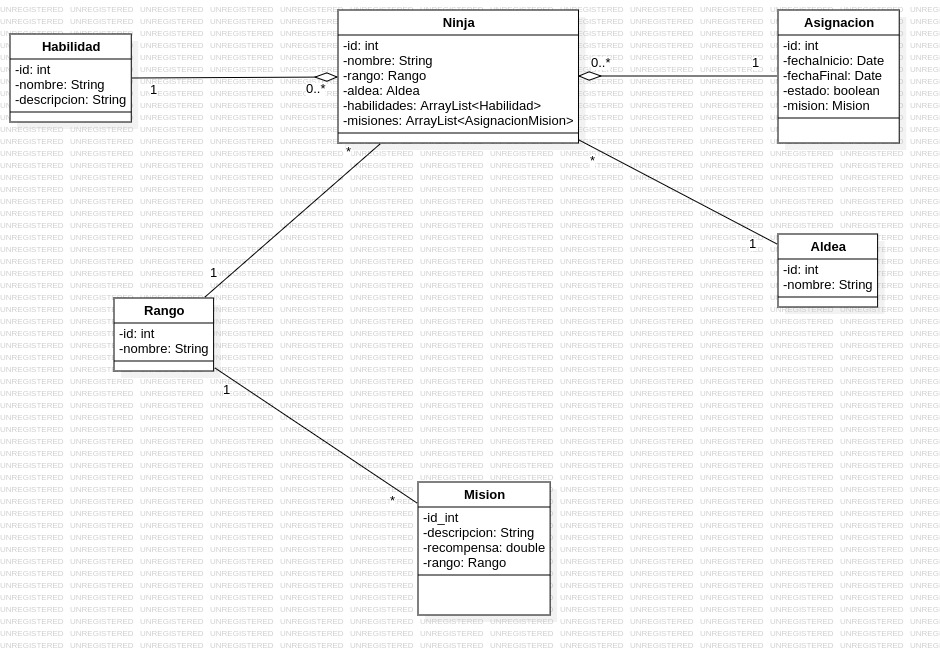

# NinjasU2 
Programa para gestionar ninjas 

## Cotenido
1. [Informacion general](#info-general)
2. [Tecnologias](#tecno)
3. [Instalacion](#install)
4. [Autores](#autores)

---

## Informacion general :speech_balloon:

- **Status**: Sin terminar :white_check_mark:

### Contenido

El programa deberia dejar hacer funciones como registro de ninjas, habilidades, misiones, etc 

**Estructura general**

- **Diagrama ER:**

- **Diagrama UML:**
  

---

## Tecnologias :computer:

- NetBeans.
- MySQL.
- Java.

---

## Instalacion :wrench:
### Requirements 
- Git.
- NetBeans.

### Step by Step 
1. Vaya a la carpeta donde clonara el repositorio 
2. Abre la terminar y copia este enlace:[(https://github.com/laura2ndrea/NinjaU2)

